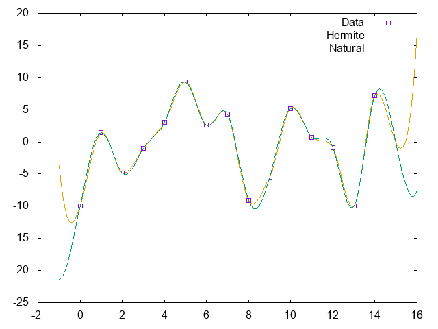

Some examples of using our DSP code library

### [fmdemod.cc](fmdemod.cc)

[Frequency modulation](https://en.wikipedia.org/wiki/Frequency_modulation) [demodulation](https://en.wikipedia.org/wiki/Demodulation) of commercial [FM broadcasting](https://en.wikipedia.org/wiki/FM_broadcasting).

```
REGION=1
FREQ=106.4M
IRATE=2048000
MRATE=256000
ORATE=44100
rtl_sdr -f $FREQ -s $IRATE - | ./fmdemod $IRATE $MRATE $ORATE $REGION | aplay -t raw -c 1 -r $ORATE -f float
```

### [fmstereo.cc](fmstereo.cc)

[Frequency modulation](https://en.wikipedia.org/wiki/Frequency_modulation) [demodulation](https://en.wikipedia.org/wiki/Demodulation) of commercial [stereo](https://en.wikipedia.org/wiki/Stereophonic_sound) [FM broadcasting](https://en.wikipedia.org/wiki/FM_broadcasting).

```
REGION=1
FREQ=106.4M
IRATE=2400000
MRATE=480000
ORATE=48000
rtl_sdr -f $FREQ -s $IRATE - | ./fmstereo $IRATE $MRATE $ORATE $REGION | aplay -t raw -c 2 -r $ORATE -f float
```

For lower CPU usage and fewer underruns, choose lower rates and avoid PulseAudio:
```
REGION=1
FREQ=106.4M
IRATE=1024000
MRATE=256000
ORATE=32000
DEVICE=$(aplay -L | grep -m1 sysdefault)
rtl_sdr -f $FREQ -s $IRATE - | ./fmstereo $IRATE $MRATE $ORATE $REGION | aplay -t raw -c 2 -r $ORATE -f float -D $DEVICE
```

### [interpol.cc](interpol.cc)

Interpolation via frequency-domain zero padding.

Use gnuplot to look at the example:
```
plot "< ./interpol" u 1:2 w l, "< ./interpol" u 1:3 w l, "< ./interpol" u 1:4 w p, "< ./interpol" u 1:5 w p
```


### [hermite.cc](hermite.cc)

Interpolation using [Cubic Hermite Spline](https://en.wikipedia.org/wiki/Cubic_Hermite_spline).

Use gnuplot to look at the example:
```
plot "< ./hermite" u 1:2 w p pt 4 t "Data", "< ./hermite" u 1:3 w l t "Hermite"
```


### [hermite2.cc](hermite2.cc)

Interpolation in 2D using [Cubic Hermite Spline](https://en.wikipedia.org/wiki/Cubic_Hermite_spline).

Use gnuplot to look at the example:
```
plot "< ./hermite2" u 2:3 w p pt 4 t "Data", "< ./hermite2" u 4:5 w l t "Hermite"
```


### [uniform.cc](uniform.cc)

Comparing interpolation between [Uniform Cubic Hermite Spline](https://en.wikipedia.org/wiki/Cubic_Hermite_spline#Catmull%E2%80%93Rom_spline) and [Uniform Natural Cubic Spline](https://en.wikipedia.org/wiki/Spline_(mathematics)#Algorithm_for_computing_natural_cubic_splines).

Use gnuplot to look at the example:
```
plot "< ./uniform" u 1:2 w p pt 4 t "Data", "< ./uniform" u 1:3 w l t "Hermite", "< ./uniform" u 1:4 w l t "Natural"
```


